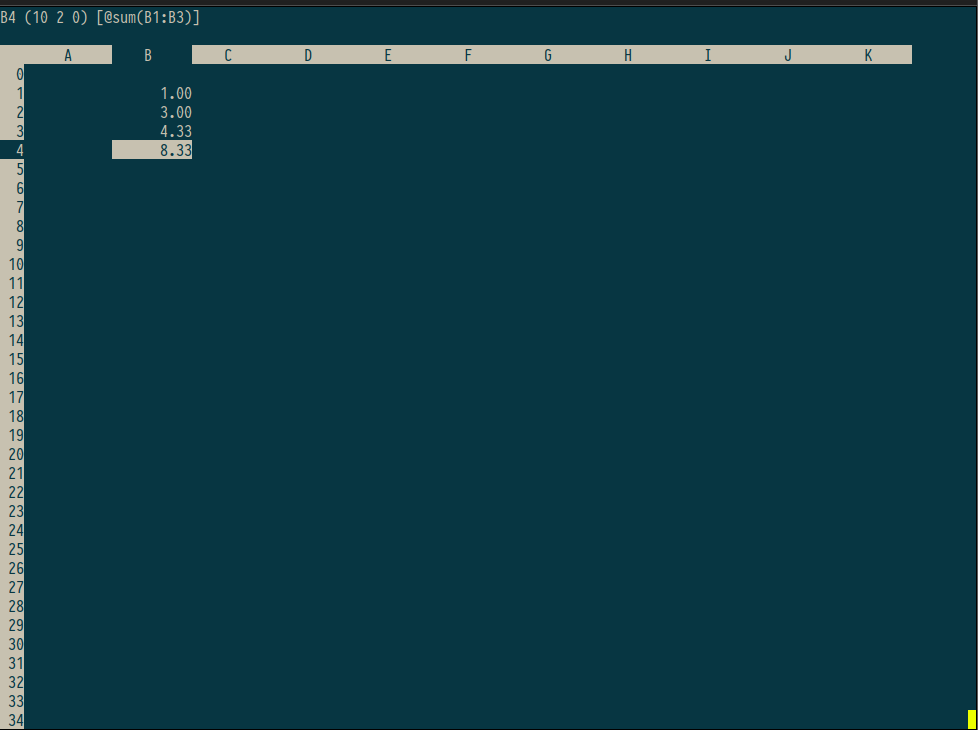

# SC - the Terminal based Spread Sheet Calculator

[](https://github.com/robrohan/sc/actions/workflows/build.yaml)

`sc` can be accessed through a terminal emulator, and has a simple interface
and keyboard shortcuts resembling the key bindings of the Vim text editor.

[Read more on Wikipedia](https://en.wikipedia.org/wiki/Sc_(spreadsheet_calculator))



## History

`sc` traces its origins to 1982, when **James Gosling** (later the creator of
Java) wrote the original public domain spreadsheet. It was subsequently posted
by **Mark Weiser** under the name `vc`. Over the following years it passed
through a series of maintainers, each adding features and fixing bugs:

- **Mark Weiser** and **Bruce Israel** (University of Maryland) made early
  modifications after Gosling's original release.
- **Robert Bond** extended the program significantly in 1986.
- **Alan Silverstein** made a further round of improvements in 1988.
- **Jeff Buhrt**, **Eric Putz**, and others contributed patches and testing
  across various releases.
- **Chuck Martin** (`nrocinu@myrealbox.com`) became maintainer at version 6.1
  and shepherded the project through to the 7.16 release in September 2002.
  He added color support, framed ranges, abbreviations, named delete buffers,
  improved vi compatibility, and much more. His philosophy was to keep sc
  focused — one thing done well — rather than accumulate features for their
  own sake.
- **Rob Rohan** (using Claude Code) ported it to modern macOS (Apple
  Silicon), fixing C99/clang compliance issues for the 8.0 release.

## Authors

| Name | Role |
|---|---|
| James Gosling | Original author (1982) |
| Mark Weiser | Early maintainer, posted as `vc` |
| Bruce Israel | Early modifications (University of Maryland) |
| Robert Bond | Major extensions (1986) |
| Alan Silverstein | Further improvements (1988) |
| Mark Nagel | `format.c` (1989) |
| Tom Anderson | Format improvements (1990) |
| Jeff Buhrt | Contributions and testing |
| Eric Putz | Contributions and testing |
| Chuck Martin | Maintainer, versions 6.1–7.16 (2001–2002) |
| Claude Code | macOS/Apple Silicon port, version 8.0 |
| Rob Rohan | macOS/Apple Silicon port, version 8.0 |

## Manual

[Mini Manual](docs/manual.pdf)

## Building

On Linux:

- install bison (e.g. `apt install bison`)
- `make`

## Troubleshooting

### Colors / cell highlighting not working

This is usually a `$TERM` mismatch. Check what your terminal reports:

```sh
echo $TERM
```

If you are running inside **tmux** (which typically sets `TERM=tmux-256color`) `sc` may not have a complete terminfo entry on all systems. To test, launch sc with:

```sh
TERM=xterm-256color sc
```

If that fixes it, you can add one of the following to your `~/.tmux.conf`:

```
# Option A — use xterm-256color inside tmux sessions
set -g default-terminal "xterm-256color"

# Option B — keep tmux-256color but add RGB override
set -g default-terminal "tmux-256color"
set -ag terminal-overrides ",tmux-256color:RGB"
```

Then restart tmux for the change to take effect.


